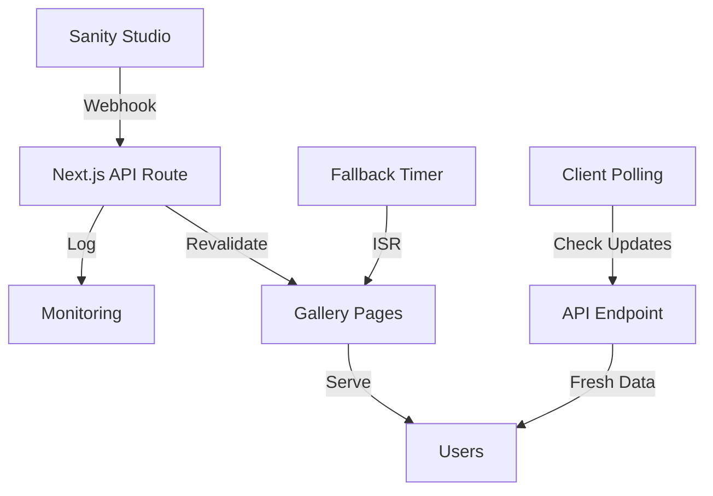

# Design Document

## Overview

This design implements a real-time gallery update system using Next.js On-Demand Revalidation triggered by Sanity webhooks. The solution combines webhook-based instant updates with time-based fallback revalidation to ensure gallery content is always current while maintaining optimal performance and reliability.

The system uses a multi-layered approach:

1. **Primary**: Sanity webhooks trigger immediate Next.js revalidation
2. **Secondary**: Time-based ISR as a fallback mechanism
3. **Tertiary**: Client-side polling for critical updates

## Architecture

### System Components



### Data Flow

1. **Content Update Flow**:

   - Content creator publishes/updates gallery in Sanity
   - Sanity sends webhook to Next.js API route
   - API route validates webhook signature
   - API route triggers revalidation of affected pages
   - Updated content is immediately available to users

2. **Fallback Flow**:

   - Time-based ISR revalidates pages every 30 seconds
   - Ensures updates even if webhooks fail
   - Provides baseline freshness guarantee

3. **Client Enhancement Flow**:
   - Client periodically checks for updates
   - Refreshes data without full page reload
   - Preserves user state (scroll, filters)

## Components and Interfaces

### 1. Webhook API Route (`/api/revalidate/gallery`)

**Purpose**: Receive Sanity webhooks and trigger page revalidation

**Interface**:

```typescript
interface WebhookPayload {
  _type: string;
  _id: string;
  slug?: { current: string };
  category?: string;
}

interface RevalidateResponse {
  revalidated: boolean;
  paths: string[];
  timestamp: number;
  error?: string;
}
```

**Security**:

- Webhook signature validation using Sanity's signing secret
- Rate limiting to prevent abuse
- Request size limits

### 2. Gallery Service Enhancement

**Purpose**: Add cache management and update detection

**New Methods**:

```typescript
interface GalleryService {
  // Existing methods...
  getLastUpdateTimestamp(): Promise<number>;
  checkForUpdates(lastKnown: number): Promise<boolean>;
  invalidateCache(galleryId?: string): void;
}
```

### 3. Client-Side Update Checker

**Purpose**: Detect and apply updates without full page reload

**Interface**:

```typescript
interface UpdateChecker {
  checkForUpdates(): Promise<boolean>;
  applyUpdates(): Promise<void>;
  onUpdate(callback: () => void): void;
}
```

### 4. Revalidation Manager

**Purpose**: Coordinate different revalidation strategies

**Interface**:

```typescript
interface RevalidationManager {
  revalidateGalleryPages(galleryId?: string): Promise<string[]>;
  revalidateByCategory(category: string): Promise<string[]>;
  scheduleRevalidation(paths: string[], delay?: number): void;
}
```

## Data Models

### Webhook Event Model

```typescript
interface SanityWebhookEvent {
  _type: "gallery";
  _id: string;
  _rev: string;
  projectId: string;
  dataset: string;
  operation: "create" | "update" | "delete";
  document: Gallery | null;
  previousDocument: Gallery | null;
  timestamp: string;
}
```

### Update Tracking Model

```typescript
interface UpdateTracker {
  lastUpdate: number;
  affectedPaths: string[];
  source: "webhook" | "timer" | "manual";
  success: boolean;
  error?: string;
}
```

## Error Handling

### Webhook Failures

- **Invalid Signature**: Return 401, log security event
- **Malformed Payload**: Return 400, log parsing error
- **Revalidation Failure**: Return 500, trigger fallback mechanism
- **Rate Limit Exceeded**: Return 429, queue for later processing

### Fallback Mechanisms

1. **Time-based ISR**: Continues to work even if webhooks fail
2. **Client-side polling**: Detects updates if server-side mechanisms fail
3. **Manual revalidation**: Admin interface for manual cache clearing
4. **Graceful degradation**: System continues to function with stale data

### Error Recovery

- Exponential backoff for failed webhook processing
- Dead letter queue for failed revalidation attempts
- Health check endpoint for monitoring system status
- Automatic retry mechanism with circuit breaker pattern

## Testing Strategy

### Unit Tests

- Webhook signature validation
- Revalidation path generation
- Update detection logic
- Error handling scenarios

### Integration Tests

- End-to-end webhook flow
- Fallback mechanism activation
- Client-side update detection
- Cross-browser compatibility

### Performance Tests

- Webhook processing latency
- Revalidation impact on page load times
- Concurrent update handling
- Memory usage under load

### Security Tests

- Webhook signature validation
- Rate limiting effectiveness
- Input sanitization
- CSRF protection

## Implementation Phases

### Phase 1: Core Webhook Infrastructure

- Create webhook API route
- Implement signature validation
- Add basic revalidation logic
- Set up logging and monitoring

### Phase 2: Enhanced Revalidation

- Implement smart path revalidation
- Add fallback ISR configuration
- Create revalidation manager
- Add error handling and recovery

### Phase 3: Client-Side Enhancements

- Implement update detection
- Add seamless content refresh
- Preserve user state during updates
- Add loading indicators

### Phase 4: Monitoring and Optimization

- Add comprehensive logging
- Implement performance monitoring
- Create admin dashboard
- Optimize for production load

## Security Considerations

### Webhook Security

- Validate all incoming webhook signatures
- Implement rate limiting per IP and signature
- Sanitize all input data
- Use HTTPS only for webhook endpoints

### Access Control

- Restrict revalidation API to authorized sources
- Implement API key authentication for manual triggers
- Log all revalidation events for audit trail
- Monitor for suspicious activity patterns

### Data Protection

- Never expose sensitive Sanity tokens in client code
- Validate all data before processing
- Implement proper CORS policies
- Use secure headers for all responses

## Performance Optimizations

### Caching Strategy

- Use Next.js built-in caching mechanisms
- Implement selective revalidation (only affected pages)
- Cache webhook validation results temporarily
- Use CDN for static assets

### Resource Management

- Limit concurrent revalidation operations
- Implement queue system for high-volume updates
- Use connection pooling for database operations
- Monitor memory usage and implement cleanup

### Network Optimization

- Compress webhook payloads
- Use HTTP/2 for better multiplexing
- Implement request deduplication
- Cache DNS lookups for external services
